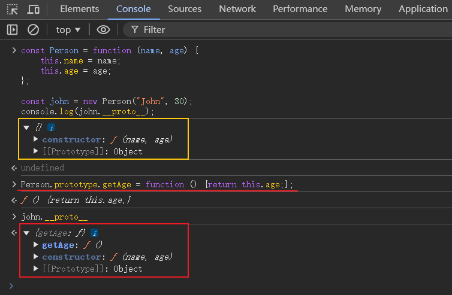

# Prototypes

当创建一个函数时，JavaScript 会自动为这个函数添加一个prototype属性

可以在任何时候对prototype对象添加或修改属性和方法，这种修改会立即反映在所有已经创建的对象实例上;

```js
// A function
const Person = function (name, age) {
    this.name = name;
    this.age = age;
};

const john = new Person("John", 30);
console.log(john.__proto__);  // {}

Person.prototype.getAge = function () {return this.age;};

console.log(john.__proto__); // { getAge: [Function (anonymous)] }

john.getAge(); // 30

console.log(john.__proto__ === Person.prototype);  //  true
```



# Prototype Inheritance


# Prototype Chain