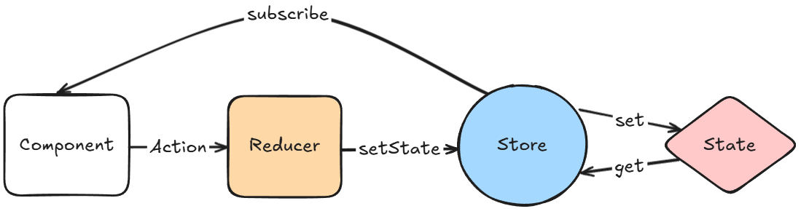

# 13-react-store-redux
- [1. 创建项目并引入Redux依赖](#1-创建项目并引入Redux依赖)
- [2. 定义并创建`Action`](#2-定义并创建action)
- [3. 创建`Reducer`](#3-创建reducer)
- [4. 创建`Store`](#4-创建store)
- [5. 使用`Provider`将store注入到组件中](#5-使用provider将store注入到组件中)
- [6. 通过`Redux Hook`使用`store`](#6-通过redux-hook使用store)
  - [6.1 `useSelector`原理](#61-useselector原理)
  - [6.2 `useDispatch`原理](#62-usedispatch原理)



## 1. 创建项目并引入Redux依赖

创建项目并引入tailwindcss：[00-project-basic/Tailwind CSS](https://github.com/huiru-wang/frontend-code-snippet/tree/main/00-project-basic#6-%E4%BD%BF%E7%94%A8postcss-%E5%92%8C-tailwind-css)
> 删除当前项目中`tsconfig.app.json`的`noUncheckedSideEffectImports`配置
```shell
# 引入redux
pnpm add redux react-redux @reduxjs/toolkit @types/react-redux
```


## 2. 定义并创建`Action`

`定义Action`：用于对Todo列表进行增、删、完成
```ts
// src/constants/ActionTypes.ts
export const ADD_TODO = 'ADD_TODO';
export const DELETE_TODO = 'DELETE_TODO';
export const COMPLETE_TODO = 'COMPLETE_TODO';
```

`创建Action`：入参分别是执行对应的Action所需的`payload`的数据
> 这里也可以不创建，在执行dispatch的时候，直接创建action，执行dispatch(action)即可，后面有对应代码
```ts
// src/actions/TodoAction.ts
import { ADD_TODO, COMPLETE_TODO, DELETE_TODO } from '../constants/ActionTypes';

// 添加Todo
export const addTodo = (text: string) => ({
    type: ADD_TODO,
    payload: {
        id: Date.now(),
        text,
        completed: false
    }
});

// 完成Todo
export const toggleTodo = (id: number) => ({
    type: COMPLETE_TODO,
    payload: {
        id,
        completed: false
    }
});

// 删除Todo
export const deleteTodo = (id: number) => ({
    type: DELETE_TODO,
    payload: {
        id
    }
});
```

## 3. 创建`Reducer`

```tsx
// src/reducers/TodoReducer.ts
import { TodoItem } from '../constants/Types';
import { ADD_TODO, COMPLETE_TODO, DELETE_TODO } from '../constants/ActionTypes';

// 初始化数据
const initialState: TodoItem[] = [
    { id: 1, text: "learn redux", completed: false }
];

// 创建reducer, 入参为state和action(包含type、payload)，返回新的state
// 根据type匹配对应的action，拿到payload，执行业务逻辑
const todoReducer = (state = initialState, action) => {
    switch (action.type) {
        case ADD_TODO: {
            const newTodo = {
                id: action.payload.id,
                text: action.payload.text || '', // 确保 text 不为 undefined
                completed: action.payload.completed || false
            };
            return [...state, newTodo];
        }
        case COMPLETE_TODO:
            return state.map(todo =>
                todo.id === action.payload.id ? {
                    ...todo,
                    completed: !todo.completed
                } : todo
            );
        case DELETE_TODO:
            return state.filter(todo => todo.id !== action.payload.id);
        default:
            return state;
    }
};

export default todoReducer;
```


## 4. 创建`Store`

```ts
// src/store/store.ts

// 传入reducer，创建store
const store = configureStore({
    reducer: {
        todos: todoReducer,
    },
});

export type TodoDispatch = typeof store.dispatch;
export type RootState = ReturnType<typeof store.getState>;

export default store;
```

## 5.使用`Provider`将store注入到组件中

```ts
// src/main.tsx

createRoot(document.getElementById('root')!).render(
  <StrictMode>
    <Provider store={store}>
      <App />
    </Provider>
  </StrictMode>,
);
```

## 6. 通过`Redux Hook`使用`store`

```tsx
// src/App.tsx

function App() {

  // 从Redux store 读取指定的todos ，如果有别的state，则选择对应的state即可
  // 当state发生变化，会重新渲染组件
  const todos = useSelector((state: RootState) => state.todos);

  // 获取 dispatch 函数，通过dispatch触发特定的Action，执行特定的reducer，从而触发state变更
  const todoDispatch = useDispatch<TodoDispatch>();

  const [inputValue, setInputValue] = useState('');

  // 通过dispatch 调用 addTodo action
  const handleAddTodo = () => {
    if (inputValue.trim()) {
      todoDispatch(addTodo(inputValue));
      setInputValue('');
    } else {
      alert('Please enter a task.');
    }
  };

  // 通过dispatch 调用 deleteTodo action
  const handleDeleteTodo = (id: number) => {
    todoDispatch(deleteTodo(id));
  };

  // 通过dispatch 调用 toggleTodo action
  const handleToggleTodo = (id: number) => {
    todoDispatch(toggleTodo(id));
  };

  return (
      ...
  );
}
export default App;
```
由于在`TodoReducer.ts`中已经定义好了每个`Action`的`type`和`payload`，这里直接引入后传给`dispatch`即可；

不提前定义`Action`，也可以直接在`dispatch`中直接写上对应的`type`和`payload`，如：
```tsx
import { ADD_TODO, DELETE_TODO, COMPLETE_TODO } from './constants/ActionTypes';

// ...

  const handleDeleteTodo = (id: number) => {
    const action = {
      type: DELETE_TODO,
      payload: {
        id
      }
    }
    dispatch(action);
  };
```

### 6.1 useSelector原理

`useSelector`用于从`store`中读取指定的`state`，当`state`发生变化，会重新渲染组件；

```ts
const todos = useSelector((state: RootState) => state.todos);
```

`useSelector`内部传入一个选择函数，必须是一个纯函数(相同的输入,总返回相同输出)，禁止在此函数中修改state；

执行过程：
1. `useSelector`内部利用了 Redux store 的订阅（subscription）机制。当组件第一次调用useSelector时，它会订阅 Redux store 的变化；在 Redux store 的订阅列表中添加一个监听器，这个监听器会关注 store 中与选择器（selector）相关的状态部分。
2. 当 Redux store 中的状态发生变化时，store 会遍历所有的订阅者，比较新值和旧值(浅比较)，如果值不同，则通知组件重新渲染。


### 6.2 useDispatch原理

是否声明`dispatch类型`，Store都可以正确执行action，只要action在所有的reducer中都不重复；store获取action后，会派发给所有的dispatch，直到匹配到type；

```ts
const todoDispatch = useDispatch<TodoDispatch>();
```

执行过程：
1. `useDispatch`从React Context 中获取 dispatch 函数。
2. 当执行`dispatch(action)` 时，将action发送给`store`；
3. `store`会根据action的type，找到对应的reducer，执行reducer，得到新的state，然后通知所有订阅者，重新渲染组件；
4. `store`的特定state被更新，则通过`useSelector`获取到新的state，重新渲染组件；
